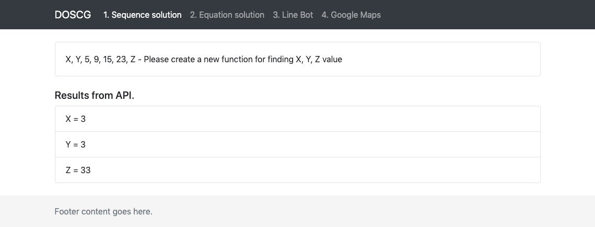
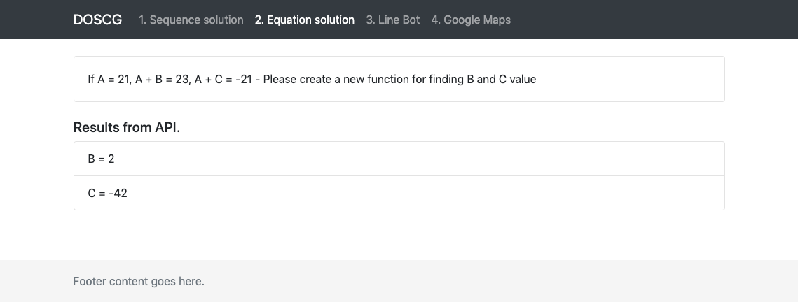
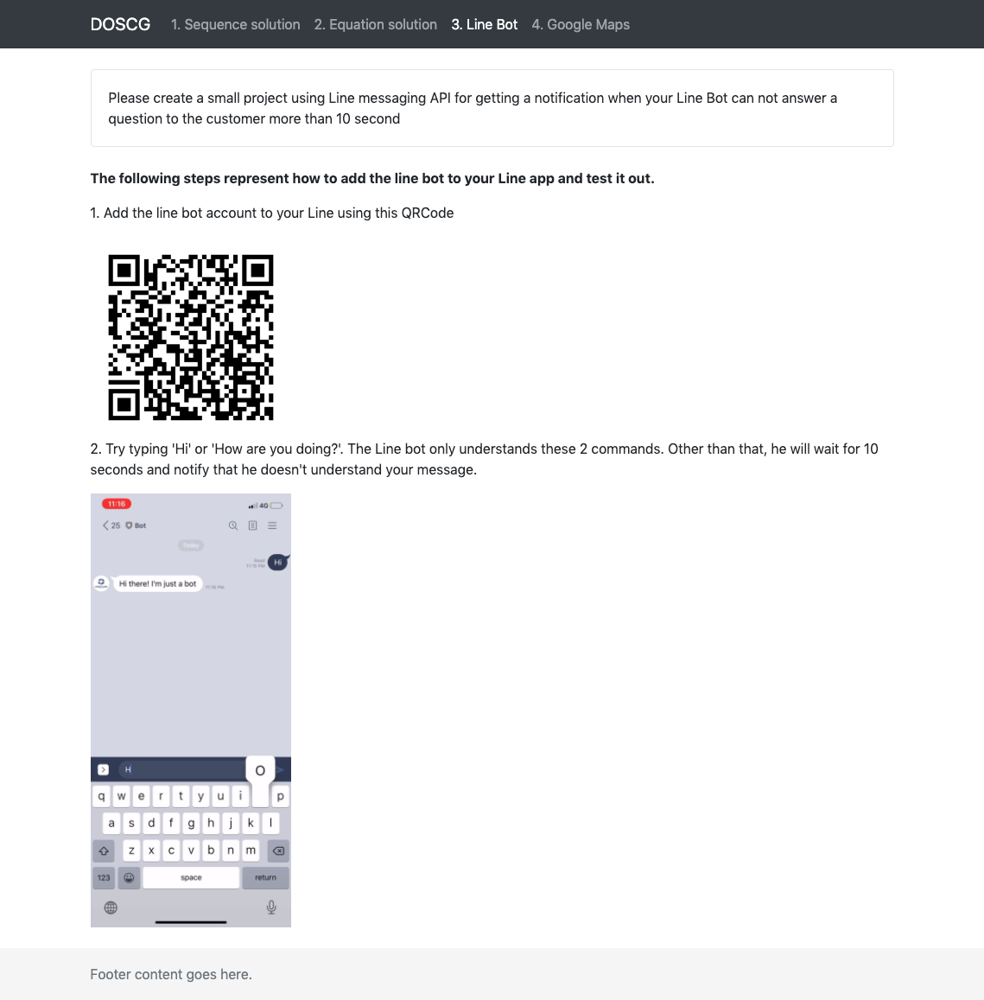
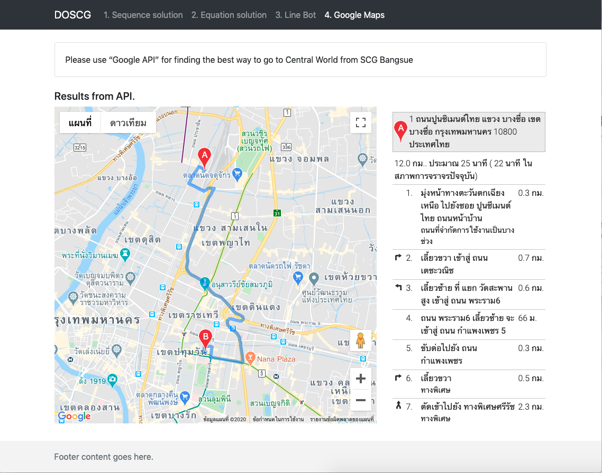

## SCG Assignment - Vue CLI Project (Frond-end)

### Installation

``` bash
# clone the project
git clone https://github.com/sarapmax/zf3-scg-assignment.git

# install npm depencencies
npm install

# serve with hot reload at localhost:8080
npm run dev
```

### Demonstration
> The web includes 4 pages.

(1) Sequence solution page (data received from the API)



(2) Equation solution page (data received from the API)



(3) Line Bot instruction page



(4)  Google MAPs page (data received from Google Maps APIs)


